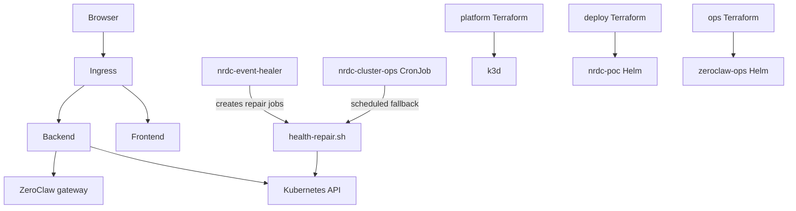

# NRDC POC — React + Express on Kubernetes

Small proof-of-concept: a **React** UI and **Express** API in containers, deployable to **Kubernetes** (local k3d or k3s on a Linux VM). The UI includes a **live cluster panel** (nodes, pods, deployments) when the API runs in-cluster.

---

## Start here

1. **Clone** this repo.
2. **Check prerequisites** (takes ~10 seconds):

   **Windows (PowerShell — window stays open in Cursor/VS Code terminal):**
   ```powershell
   cd <path-to-repo>   # e.g. E:\Projects\NRDC
   .\scripts\check-prerequisites.ps1
   ```

   **Windows (double-click or window closes too fast):**
   - Run `scripts\check-prerequisites.cmd`, or
   - `.\scripts\check-prerequisites.ps1 -Wait`

   **Windows / Git Bash (`check-prerequisites.sh`):**
   ```bash
   ./scripts/check-prerequisites.sh
   ```
   On Git Bash the script waits for **Enter** before closing. Use `./scripts/check-prerequisites.sh --no-pause` to skip that in an open terminal.

   **macOS / Linux:**
   ```bash
   chmod +x scripts/*.sh
   ./scripts/check-prerequisites.sh
   ```

3. **Pick a run mode** below (A, B, C, or D).

---

## Prerequisites

Install these before running the app. Use the check script above to confirm each item.

| Tool | Required for | Version | Windows install | macOS / Linux |
|------|----------------|---------|-----------------|---------------|
| **Node.js** | All modes | **20+** | [nodejs.org](https://nodejs.org/) or `winget install OpenJS.NodeJS.LTS` | [nodejs.org](https://nodejs.org/) or `nvm install 20` |
| **npm** | All modes | (with Node) | Included with Node | Included with Node |
| **Docker Desktop** | Compose, Kubernetes | Latest | [docker.com/products/docker-desktop](https://www.docker.com/products/docker-desktop/) | Docker Desktop or Docker Engine |
| **kubectl** | Kubernetes only | Latest | `winget install Kubernetes.kubectl` | [kubectl install guide](https://kubernetes.io/docs/tasks/tools/) |
| **k3d** | Local Kubernetes (Windows/macOS/Linux) | Latest | `winget install k3d` or [k3d releases](https://github.com/k3d-io/k3d/releases) | `curl -s https://raw.githubusercontent.com/k3d-io/k3d/main/install.sh \| bash` |
| **Git** | Optional | Any | [git-scm.com](https://git-scm.com/) | `apt install git` / Xcode CLI |

### Docker Desktop settings (Windows)

- **Do not** enable “Use Windows containers” — use **Linux containers** (default).
- Enable **WSL 2** engine when prompted.
- Wait until the tray icon shows **Docker Desktop is running** before `docker ps` or k3d commands.

### Check prerequisites by profile

```powershell
# What you need for each run mode:
.\scripts\check-prerequisites.ps1 -Profile dev          # npm only
.\scripts\check-prerequisites.ps1 -Profile compose      # Docker Compose
.\scripts\check-prerequisites.ps1 -Profile kubernetes   # k3d + kubectl + cluster
```

```bash
./scripts/check-prerequisites.sh dev
./scripts/check-prerequisites.sh compose
./scripts/check-prerequisites.sh kubernetes
```

---

## Choose how to run

| Mode | Best for | Cluster UI in browser | Prerequisites profile |
|------|----------|------------------------|------------------------|
| **A — Local dev** | Fast UI/API coding | Only if API uses your kubeconfig | `dev` |
| **B — Docker Compose** | Quick full stack, no K8s | No | `compose` |
| **C — Kubernetes (k3d)** | Full POC, same as prod pattern | **Yes** | `kubernetes` |
| **D — Kubernetes (k3s VM)** | LGC / Linux server demo | **Yes** | `kubernetes` on VM |

---

## Option A — Local development (npm)

No Docker or Kubernetes required. Fastest for changing React/Express code.

**Terminal 1 — API**

```powershell
cd backend
npm install
npm run dev
```

**Terminal 2 — UI** (proxies `/api` to port 3000)

```powershell
cd frontend
npm install
npm run dev
```

Open **http://localhost:5173**

- Health / hello / items work immediately.
- **Cluster panel:** shows data only if `kubectl` works on your machine (kubeconfig points at a cluster). Otherwise it shows a short “not available” message.

**Windows helper** (starts backend only):

```powershell
.\scripts\dev.ps1
```

---

## Option B — Docker Compose

Runs both containers on Docker; no Kubernetes.

```powershell
.\scripts\check-prerequisites.ps1 -Profile compose
docker compose up --build
```

Open **http://localhost:8080**

- Health, hello, and items work as usual.
- **Cluster panel** is intentionally off in Compose (not running on Kubernetes). Use **Option C** for the live cluster UI.

Stop with `Ctrl+C`, then `docker compose down` if needed.

---

## Option C — Kubernetes on your PC (k3d)

Full POC: containers in a real cluster + cluster details in the UI.

### One-time setup

1. Install Docker Desktop, kubectl, k3d (see table above).
2. Create a cluster (1 node is enough for dev):

   ```powershell
   k3d cluster create nrdc-poc --agents 0
   ```

   Verify:

   ```powershell
   kubectl get nodes
   .\scripts\check-prerequisites.ps1 -Profile kubernetes
   ```

### Deploy (every time after clone or major changes)

**Windows — single script:**

```powershell
.\scripts\deploy-local-k3d.ps1
```

First time, if the cluster does not exist yet:

```powershell
.\scripts\deploy-local-k3d.ps1 -CreateCluster
```

**macOS / Linux:**

```bash
./scripts/deploy-local-k3d.sh --create-cluster   # first time only
./scripts/deploy-local-k3d.sh
```

**Manual steps** (if you prefer):

```powershell
.\scripts\build-images.ps1
k3d image import nrdc-poc-backend:latest nrdc-poc-frontend:latest -c nrdc-poc
kubectl apply -f k8s\
kubectl rollout status deployment/backend deployment/frontend -n nrdc-poc
```

### Open the app

```powershell
kubectl port-forward -n nrdc-poc svc/frontend 8080:80
```

Open **http://localhost:8080** — scroll to **Cluster summary**, **Nodes**, and **POC pods**.

Leave port-forward running in that terminal.

---

## Option D — Kubernetes on a Linux VM (k3s / LGC)

For the tech-lead demo on a server (e.g. LGC Linux VM).

### VM prerequisites

- Ubuntu 22.04/24.04 LTS (recommended)
- 2+ vCPU, 4 GB RAM, 20 GB disk
- Docker **not** required on the VM for k3s (k3s bundles containerd)

### Install k3s on the VM

```bash
curl -sfL https://get.k3s.io | sh -
mkdir -p ~/.kube
sudo cp /etc/rancher/k3s/k3s.yaml ~/.kube/config
sudo chown "$USER:$USER" ~/.kube/config
kubectl get nodes
```

### Build and deploy from your PC or the VM

On a machine with Docker:

```bash
./scripts/build-images.sh
# On the k3s node:
./scripts/import-images-k3s.sh
./scripts/deploy-k8s.sh
kubectl get pods -n nrdc-poc
```

Or push images to a registry later (recommended for real environments).

### Access

Add to your PC hosts file: `<VM-IP>  nrdc-poc.local`

Open **http://nrdc-poc.local** (Ingress), or use port-forward as in Option C.

---

## After code changes (redeploy)

**k3d on Windows:**

```powershell
.\scripts\build-images.ps1
k3d image import nrdc-poc-backend:latest nrdc-poc-frontend:latest -c nrdc-poc
kubectl rollout restart deployment/backend deployment/frontend -n nrdc-poc
```

Or:

```powershell
.\scripts\deploy-local-k3d.ps1 -SkipBuild:$false
```

**k3s on Linux VM:**

```bash
./scripts/build-images.sh
./scripts/import-images-k3s.sh
kubectl rollout restart deployment/backend deployment/frontend -n nrdc-poc
```

---

## Project layout

| Path | Purpose |
|------|---------|
| `backend/` | Express API — health, cluster, infrastructure, test lab |
| `frontend/` | Vite + React UI — dashboard, test lab, cluster panel |
| `deploy/helm/nrdc-poc/` | App Helm chart (Option E) |
| `deploy/terraform/` | App Terraform environments |
| `platform/terraform/` | k3d cluster Terraform |
| `ops/helm/zeroclaw/` | ZeroClaw gateway, event healer, repair CronJob |
| `ops/terraform/` | Ops Terraform environments |
| `k8s/` | Legacy flat manifests (Options B/C reference) |
| `docker-compose.yml` | Option B — local containers |
| `scripts/` | Prerequisites, build, deploy, test helpers |
| `docs/local-setup.md` | Full Option E guide |

### Scripts reference

| Script | Purpose |
|--------|---------|
| `check-prerequisites.ps1` / `.sh` / `.cmd` | Verify tools (profiles: `dev`, `compose`, `kubernetes`, `local`) |
| `build-images.ps1` / `.sh` | Build app container images |
| `import-images-k3d.ps1` | Build + import app and ops images into k3d |
| `local-deploy.ps1` | Full Option E deploy (platform → deploy → ops) |
| `local-destroy.ps1` | Tear down Option E stack |
| `local-e2e-test.ps1` | E2E validation (app + L1 heal) |
| `local-ops-test.ps1` | Ops layer validation (ZeroClaw + CronJob) |
| `deploy-local-k3d.ps1` / `.sh` | Legacy Option C — flat k8s manifests |
| `dev.ps1` | Start backend dev server (Windows) |

---

## Troubleshooting

| Problem | Fix |
|---------|-----|
| `bash` not recognized (Windows) | Use PowerShell scripts (`.ps1`), not `curl \| bash` for k3d — use `winget install k3d` |
| `docker_engine` pipe not found | Start **Docker Desktop**; wait until running; run `docker ps` |
| Pods `ImagePullBackOff` | Images not in cluster: `k3d image import nrdc-poc-backend:latest nrdc-poc-frontend:latest -c nrdc-poc` |
| `port-forward` — pod Pending | Wait for pods `Running`: `kubectl get pods -n nrdc-poc` |
| Cluster panel empty / error | Apply RBAC: `kubectl apply -f k8s/backend-rbac.yaml`; redeploy backend |
| `/api/cluster` 500 in Docker Compose | Expected — cluster UI needs Option C; Compose sets `DISABLE_CLUSTER_API=true` |
| `HTTP protocol is not allowed` in logs | Backend tried host kubeconfig from a container; fixed in latest code — rebuild: `docker compose up --build` |
| Prerequisites script fails | Install failing tools from table above; re-run check script |
| Terminal closes after `.sh` on Windows | Use `scripts\check-prerequisites.cmd`, or `./scripts/check-prerequisites.sh --no-pause` in an open terminal |

---

## Architecture

**Option C (legacy):** Browser → Ingress → Frontend / Backend → Kubernetes API

**Option E (local-first):**



The backend uses a **read-only ServiceAccount** (extended for test lab: pod delete, job create, log read).

---

## k3s vs RKE2 (production path)

| Option | Use when |
|--------|----------|
| **k3s** | Single VM, POC, low resource (recommended first) |
| **k3d** | Local dev on laptop before touching LGC |
| **RKE2** | Hardened multi-node production later |
| **Docker Compose** | App-only demo, not Kubernetes |

---

## Demo script (tech lead)

**Option C / legacy:**

1. `kubectl get nodes` — show cluster size.
2. Open UI — **Cluster summary** (node count, version, pods).
3. `kubectl get pods -n nrdc-poc -o wide` — match UI to CLI.
4. `kubectl delete pod -n nrdc-poc -l app=backend` — pod recreates (L1).

**Option E (recommended):**

1. Open http://nrdc-poc.local — show **Infrastructure overview** (3 Terraform layers).
2. Show **Auto-heal pipeline** — L1, L2-event, L2-scheduled.
3. In **Failure test lab**, kill a probe — watch activity log and probe cards recover.
4. Mention scheduled fallback (CronJob every 2 min) if event healer misses a failure.
5. `.\scripts\local-e2e-test.ps1` — automated validation.

---

## Option E — Local-first (Terraform + ZeroClaw on k3d)

Full instruction-as-infra stack on your laptop **before Azure**. Uses three Terraform roots (platform → deploy → ops), Helm charts, and a dual-layer healer (event-driven + scheduled fallback).

**Prerequisites:** Docker Desktop (≥8 GB RAM), k3d, kubectl, Terraform, Helm

```powershell
.\scripts\check-prerequisites.ps1 -Profile local
```

Add to hosts file: `127.0.0.1  nrdc-poc.local`

**Deploy:**

```powershell
.\scripts\local-deploy.ps1 -AutoApprove
```

**Test:**

```powershell
.\scripts\local-e2e-test.ps1
.\scripts\local-ops-test.ps1
```

**Destroy:**

```powershell
.\scripts\local-destroy.ps1 -AutoApprove
```

**Open:** http://nrdc-poc.local

The UI includes an **infrastructure dashboard** (Terraform layers, auto-heal pipeline), **failure test lab** (kill probes, watch healer activity), and **cluster details**.

See [docs/local-setup.md](docs/local-setup.md) for architecture, API endpoints, redeploy steps, and troubleshooting.

---

## Next steps (after POC)

- Private container registry (GHCR, ACR, Harbor)
- Helm or Kustomize per environment
- TLS (cert-manager / Traefik)
- GitHub Actions: build → push → deploy
