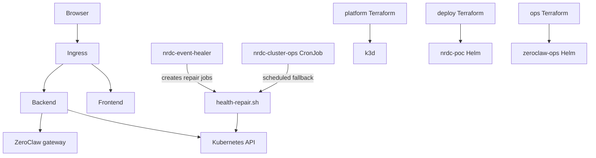

# Local setup — Option E (Terraform + Helm + ZeroClaw on k3d)

Full **instruction-as-infrastructure** stack on your laptop before Azure. Three Terraform roots deploy platform, application, and operations layers via Helm.

---

## Prerequisites

| Tool | Purpose |
|------|---------|
| Docker Desktop | Build images; k3d runtime (≥8 GB RAM recommended) |
| k3d | Local Kubernetes cluster |
| kubectl | Cluster access |
| Terraform | Platform / deploy / ops apply |
| Helm | Used by Terraform providers (installed with Terraform workflow) |

Verify:

```powershell
.\scripts\check-prerequisites.ps1 -Profile local
```

Add to your hosts file:

```
127.0.0.1  nrdc-poc.local
```

---

## Architecture



### Terraform layers

| Layer | Path | Manages |
|-------|------|---------|
| **Platform** | `platform/terraform/environments/local/` | k3d cluster `nrdc-poc`, image import |
| **Application** | `deploy/terraform/environments/local/` | Helm release `nrdc-poc` (backend, frontend, ingress) |
| **Operations** | `ops/terraform/environments/local/` | Helm release `zeroclaw-ops` (ZeroClaw, event healer, repair CronJob) |

Apply order is always **platform → deploy → ops**. The orchestrator script runs this sequence.

### Auto-heal pipeline

| Layer | Component | Latency | Role |
|-------|-----------|---------|------|
| **L1** | Kubernetes liveness/readiness probes + Deployment controller | Seconds | Recreates failed pods automatically |
| **L2-event** | `nrdc-event-healer` deployment (`failure-watcher.sh`) | ~8s grace after sustained failure | Polls every 3s; creates `nrdc-cluster-ops-event-*` repair jobs |
| **L2-scheduled** | `nrdc-cluster-ops` CronJob | Every 2 min | Fallback via `health-repair.sh` if event path misses a failure |

Both L2 paths share `ops/helm/zeroclaw/files/health-repair.sh`. Log prefixes identify the trigger: `[nrdc-event-healer]`, `[nrdc-cluster-ops]`, `[nrdc-manual-repair]`.

**Note:** A single probe kill often recovers via L1 before the event healer’s 8s grace period. The event healer targets **sustained** deployment or health failures.

---

## Deploy

Full stack:

```powershell
.\scripts\local-deploy.ps1 -AutoApprove
```

This runs:

1. `platform/terraform/environments/local` — cluster + image import
2. `deploy/terraform/environments/local` — app Helm chart
3. `ops/terraform/environments/local` — ops Helm chart

Skip image rebuild (cluster already has images):

```powershell
.\scripts\local-deploy.ps1 -AutoApprove -SkipBuild
```

**Open:** http://nrdc-poc.local

---

## Validate

```powershell
.\scripts\local-e2e-test.ps1      # App health, cluster API, L1 heal
.\scripts\local-ops-test.ps1      # ZeroClaw gateway, CronJob, event healer
```

Manual checks:

```powershell
kubectl get pods -n nrdc-poc
kubectl get pods -n ops
kubectl get deploy -n ops nrdc-event-healer zeroclaw-ops
curl -H "Host: nrdc-poc.local" http://127.0.0.1/health
```

---

## UI features

The app UI at http://nrdc-poc.local includes:

- **Infrastructure overview** — Terraform layers, auto-heal status, ZeroClaw gateway state
- **Failure test lab** — Kill probes or node workloads; watch live activity log and healer countdown
- **Cluster panel** — Nodes, pods, deployments (same as legacy Option C)

The live monitor polls every 2 seconds. Activity log events are stored server-side (ring buffer, max 500).

### Probe cards

Each probe row is `{deployment}-{container}-{type}::{podName}` — one card per pod per probe (readiness and liveness are separate). During a kill you may briefly see extra cards (terminating pod + replacement pending).

---

## API endpoints

| Method | Path | Description |
|--------|------|-------------|
| GET | `/api/infrastructure` | Terraform layers, L1/L2 heal status, ZeroClaw state |
| GET | `/api/testlab/status` | Probes, nodes, healer countdown, repair job summary |
| GET | `/api/testlab/activity?limit=500` | Activity log events |
| POST | `/api/testlab/kill-probe` | Body: `{ "probeId": "backend-backend-liveness::pod-name" }` |
| POST | `/api/testlab/kill-node` | Body: `{ "nodeName": "k3d-nrdc-poc-server-0" }` |
| POST | `/api/testlab/trigger-repair` | Creates manual repair job from CronJob template |

Backend RBAC (in-cluster ServiceAccount) allows read-only cluster access plus pod delete, job create, and log read for the test lab.

---

## Redeploy after code changes

**App (backend/frontend):**

```powershell
.\scripts\build-images.ps1
k3d image import nrdc-poc-backend:latest nrdc-poc-frontend:latest -c nrdc-poc
terraform -chdir=deploy/terraform/environments/local apply -auto-approve
kubectl rollout restart deployment/backend deployment/frontend -n nrdc-poc
```

Or rebuild and import all images:

```powershell
.\scripts\import-images-k3d.ps1
terraform -chdir=deploy/terraform/environments/local apply -auto-approve
kubectl rollout restart deployment/backend deployment/frontend -n nrdc-poc
```

**Ops (healer scripts, ZeroClaw image):**

```powershell
docker build -t nrdc-zeroclaw-ops:local ops/docker/zeroclaw-ops
k3d image import nrdc-zeroclaw-ops:local -c nrdc-poc
terraform -chdir=ops/terraform/environments/local apply -auto-approve
```

If Helm template changes are not picked up, force replace:

```powershell
terraform -chdir=ops/terraform/environments/local apply -auto-approve -replace=helm_release.zeroclaw_ops
```

**Platform Terraform** rebuilds images when Dockerfiles change (hash trigger). Source-only app changes require manual rebuild/import as above.

---

## Destroy

```powershell
.\scripts\local-destroy.ps1 -AutoApprove
```

Destroys ops → deploy → platform (reverse order). Does not remove Docker images from your machine.

---

## ZeroClaw and Ollama

Local ops values (`ops/terraform/environments/local/values-local.yaml`) set `ollama.enabled: false` to reduce resource use. ZeroClaw gateway still runs; LLM-backed repair reasoning is optional locally.

Optional API keys: copy `.env.example` to `.env` for OpenRouter or external Ollama — never commit `.env`.

**Ops debugging:**

```powershell
kubectl logs -n ops deploy/nrdc-event-healer -f
kubectl logs -n ops -l app=zeroclaw-ops -f
kubectl port-forward -n ops svc/zeroclaw-ops 42617:42617
```

---

## Troubleshooting

| Problem | Fix |
|---------|-----|
| `nrdc-poc.local` does not resolve | Add `127.0.0.1 nrdc-poc.local` to hosts file |
| `ImagePullBackOff` | Import images: `.\scripts\import-images-k3d.ps1` |
| Event healer not creating jobs | Check RBAC: `kubectl auth can-i create jobs -n ops --as=system:serviceaccount:ops:zeroclaw-ops` |
| Helm changes not applied | `terraform apply -replace=helm_release.*` in the relevant root |
| Test lab empty / 403 | Apply deploy RBAC: redeploy `deploy/terraform/environments/local` |
| Activity log scroll jumps | Fixed in UI via scroll preservation; hard-refresh if cached |
| L2 never fires on single probe kill | Expected — L1 often heals first; try sustained failure or manual `POST /api/testlab/trigger-repair` |

---

## Related docs

- [README.md](../README.md) — All run modes (A–E), prerequisites, demo script
- [AGENTS.md](../AGENTS.md) — Agent-oriented deploy commands and safety rules
